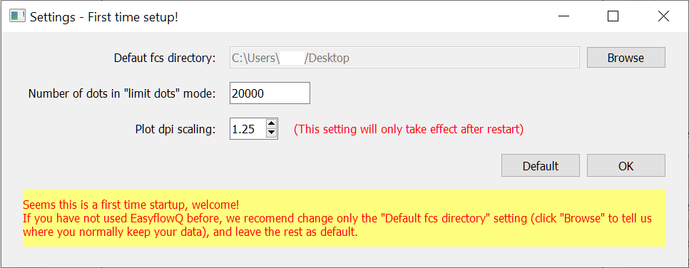
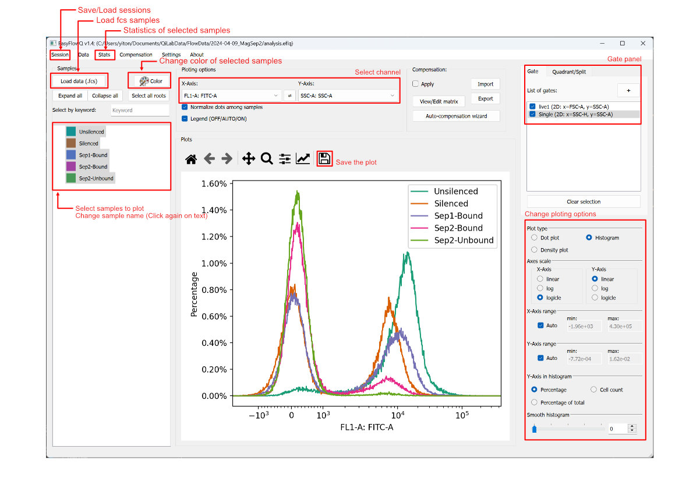

# Startup, simple plot and gate

This page will describe the basics of using EasyFlowQ, including basic settings, loading sessions and FCS files, as well as basic analysis method. For a step-by-step example, please visit our [Tutorial](Tutorial.md) page.

## First time setup
---

Upon the first time start, EasyFlowQ will greet you with the setting window (see below). If this is your first time using EasyFlowQ, we recommend you only change the first setting (**Default fcs directory**). Click browse and select the top-most folder that you normally keep your flow cytometry data. The EasyFlowQ will always open this directory when you load sessions or fcs files, and it will speed up your analysis workflow. 

{: style="width:600px"}

The other settings you can change in this page include:

 - **Limit total number of dots**: Decrease the number if refreshing of dot plot is slow. 
 - **Plot DPI scaling**: Tweak this if your plots' font and marks are unreasonably small or large. Generally tweak this number up will make font larger. *This is only applied to the plotting region!*

Click the "Default" button if you want to reset all settings to default.

If you encounter a "Permission Error" pop up after clicking "OK". That suggest you likely do not have the permission to write in the installed directory. The settings are not saved but you can continue to use the program and do analysis. To correct this, run the program as administrator.

Don't worry if you missed this. This setting window is always available in the "settings" menu.

## Simple analysis workflow
---
Here we list some of the basic operations for a simple analysis:

1. **Load sample:** To load samples, on the click Data -> Load data files (or simply Ctrl+L). You can load multiple files, and a list of data will be shown on the left.
2. **Change sample names:** Double click on the samples to change the sample's name.
3. **Plotting:** Select the samples you want to plot on the main plotting region. Yes, it support multi-selection.
4. **Change color:** To change colors of your sample, click the "Sample color" button on the top panel. Note that all the samples that are currently selected will be affected by your color change.
5. **Tweak plot options:** You can change how the figures are plotted in the plotting option panel in the lower-right conner. EasyFlowQ support bot dot plots, and histograms, as well as customizable plotting ranges, axes scales, normalization and smoothing. More plot types like stacked histogram and density plots are on our developing road map. 
6. **Choose plot axises:** You can choose what channel(s) are plotted in the top panel. Note that the y-axis option is ignored in histogram mode.
7. **Save the plot:** The plot can be save by clicking on the "Save" icon on top of the plot. Several types of image formats (png, jpg, pdf...) are supported. 
8. **Save the session**: You can save the analysis session by using the "Save session" function in the menu (or simple Ctrl+S). We recommend put the session file in the same directory as your fcs files, or one level up.

Below you can see an annotated screenshot about the operations mentioned above.

## Gating
---
Currently EasyFlowQ provides two gating types: *polygon (2D)* and *line (1D)*. To start drawing gates, click on the "+" in the "Gate" panel (upper right). You will enter the corresponding gate drawing mode, based on your current plot type (change in the "Plot type" section). For *polygon gate**, left click to create a new vertex, and right click will close the gate (if more than three vertices exist). For *line gate*, the 2nd vertex will automatically close the gate. 

Check the desired gates in the "Gate" panel to apply that gate onto the samples. **Currently, all gatings are "global". This means if a gate is checked, all the samples plotted will be gated by that gate! This is enforced so that all samples plotted are under the same gating conditions.** For situations that different gates for different samples are required, please refers to the [Subpopulation section](Subpopulation.md).

**Known bug specific to MacOS version**: After closing of the polygon gates (right/ctrl click), there is a chance some parts of the interface will freeze. Simply right click again in the gate section, and the interface should unfreeze. This is likely due to the GUI is confused between right click vs ctrl-click on the MacOS (should be the same, but sometime is recorded differently).

#### Plot the gate
You can also select the gate to show on the plot. Note, it only works if you have the right axis(s) (where the gates are defined) selected. To clear the selection, click the "Clear selection" button in the "Gate" panel.

#### Edit or delete existing gates
Right click the existing gates in the "Gate" section, and you will see the options to edit or delete.