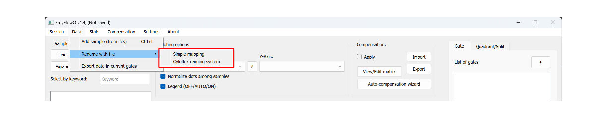
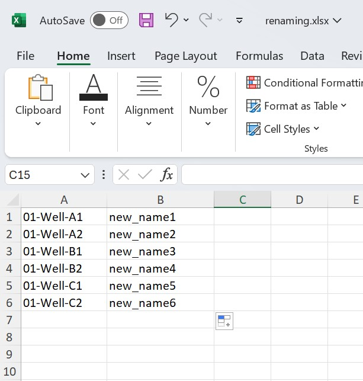

# Batch-renaming with xlsx
Renaming samples from a high throughput experiment setup can be time consuming. EasyflowQ provides two methods to batch renaming samples names. Both methods provides a easy way for batch renaming your samples using a excel files (.xlsx). To access these tools, go to "Data" -> "Rename with file" (see below).

## Regular rename (Single mapping)
---
For basic renaming, create a excel file (.xlsx), with the old name in the first column (A), and new names in the second column (B). Save this excel file at desired location. We recommend the same folder as the .fcs files. Here is an example:

{: style="width:300px"}

Then go back to EasyFlowQ, and select **Simple mapping** in the menu, and load the file created above.

## [CytoFLEX](https://www.beckman.com/landing/ppc/flow/cytoflex) format file names
---
The BECKMAN's CytoFLEX flow cytometer use a unique naming system when under the plate mode. 