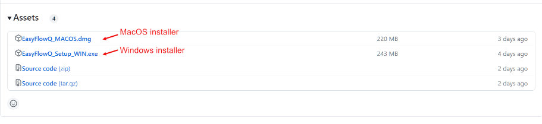

# Welcome to EasyFlowQ
EasyFlowQ is an open-source, user-friendly flow cytometry analyzer with graphic user interface (GUI).
For full documentation and tutorials, visit [EasyFlowQ's Documentation Site](https://ym3141.github.io/EasyFlowQ/).

## Overview
---
A user friendly GUI interface for analyzing flow cytometry data. The program is implemented by Qt/Python, and its UI logics are largely influenced by the original matlab version of [EasyFlow (by @ayaron)](https://github.com/AntebiLab/easyflow). The fcs file parser is based on the [FlowCal package](https://github.com/taborlab/FlowCal), with slight modification for implementing into the GUI. The standalone installers are packaged by [PyInstaller](https://pyinstaller.org/en/stable/) and [InstallForge](https://installforge.net/).

## Download, install and run
---
You can either install EasyFlowQ via the provided [installers](#method-1-use-the-provided-installer-windows-or-macos), download [through PyPI](#method-2-install-from-the-python-package-index-pypi), or [run it directly with python](#method-3-run-from-python-a-python-installation-is-needed) ([Anaconda](https://www.anaconda.com/) installation required).

#### **Method #1:** Use the provided installer (Windows or MacOS)

Please refer to [release page](https://github.com/ym3141/EasyFlowQ/releases/latest) (see below) to download the latest standalone packages for your operating system (MacOS or Windows) and install EasyFlowQ. In most case, you should be able to run it without other dependency.



**Special note for MacOS users**: Due to MacOS's inherent "safety features", you might need two additional steps to run the program:

1. If you encounter the message of "**EasyFlowQ_MACOS Is Damaged and Can’t Be Opened. You Should Move It To The Trash**", this is just Apple telling you they don't trust where this is downloaded (see similar  asked before [here](https://discussions.apple.com/thread/253714860?sortBy=best)). To get rid of this attribute, simple run the following commend in a terminal:

    ```
    xattr -d com.apple.quarantine /Applications/EasyFLowQ_MACOS.app
    ```

2. If you encounter the message of "...because the developer cannot be verified...", you will need to ctrl/right-click the app and select open for the first time after you put the app into the "Application" folder. The system will remember it as an exception for later time (see [here](https://support.apple.com/guide/mac-help/open-a-mac-app-from-an-unidentified-developer-mh40616/mac)).


#### **Method #2:** Install from the Python Package Index (PyPI) 

To download EasyFlowQ from PyPI:
```
pip install EasyFlowQ
```

After installation, run:
```
EasyFlowQ
```

Or run it from a script using:
```
import EasyFlowQ.main_entry
EasyFlowQ.main_entry.newWindowFunc()
```

#### **Method #3:** Run from python (a python installation is needed)

For running the program from the source, download the whole code and run the command below. Standard Anaconda should be sufficient for running the program **up to v1.5**. Starting from v1.6, PySide6 is also required for running the code.
```
Path/To/Folder$ python ./main.py
```

## First time startup
---
For first time startup settings, please go to our [usage page](https://ym3141.github.io/EasyFlowQ/Basic%20Usage/#first-time-setup).

## Contact and citation
---
For more info please contact <yitongma7@gmail.com>. If you use *EasyFlowQ* in your research, we would appreciate citation to the following preprint:
> Ma, Y., & Antebi, Y. (2023). EasyFlow: An open source, user friendly cytometry analyzer with graphic user interface (GUI). bioRxiv, 2023-08.
