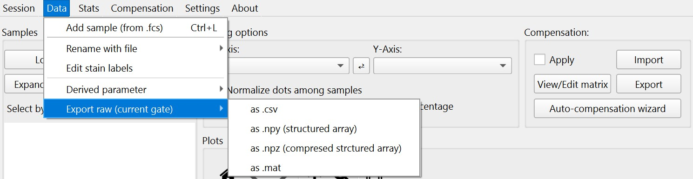
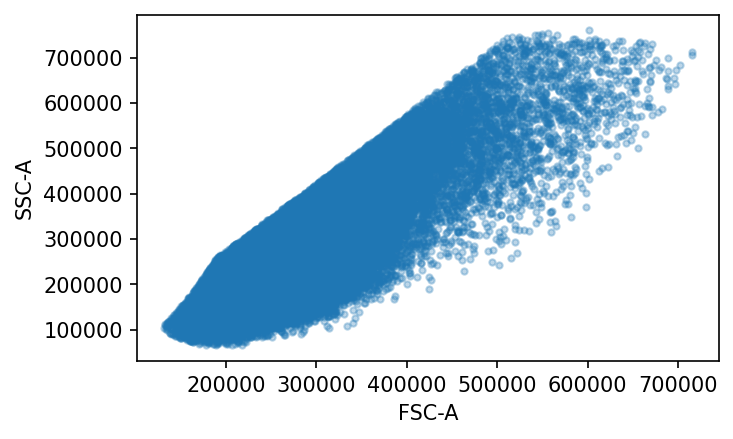
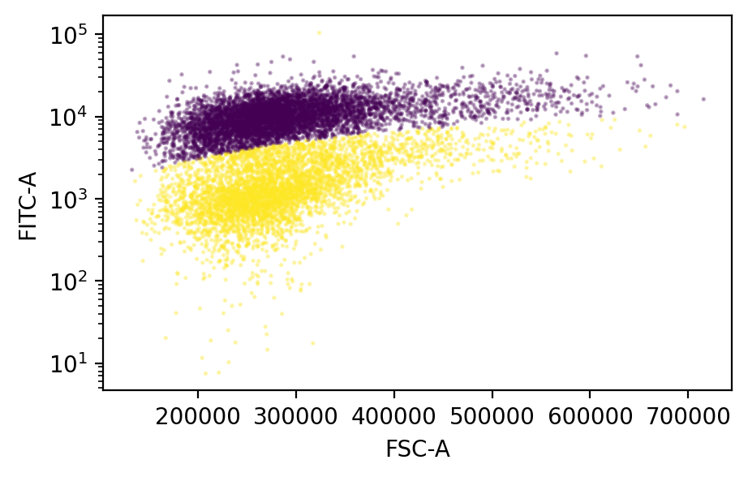

# Access gated raw data
EasyFlowQ offers essential tools for exporting gated samples as raw data in widely-used formats. These formats are compatible with popular programming languages, ensuring seamless integration and accessibility for more complex analysis.

## Export as fcs, csv, npy(z) and mat
The options for exporting the **currently selected** samples and subpopulation samples, with **selected** gate applied, can be access from the menu bar: Data --> Export raw (current gate)



Popular formats including fcs (FCS3.1), csv, npy/npz (numpy array) and mat (matlab data file) are available for export. Each sample (or subpopulation) is exported as a single file, named `<sample>_<gate>` by default, where `<gate>` is the most downstream gate applied to it, i.e. the last checked gate of the gate list. Exporting the same samples under a different gate therefore produces a different set of files, rather than overwriting the previous one. A sample exported with no gate applied simply keeps its own name.

Note that a gate that is merely *highlighted* in the gate list is drawn on the plot and its percentage is reported, but it is not applied to the data. It is consequently not part of the exported events, nor of the default file name.

Before anything is written, EasyFlowQ asks where the files should go and lets you rename them:

* When a **single** sample is exported, the usual "save as" dialog opens, with the default name filled in. Edit it as you like, and pick any folder.
* When **several** samples are exported at once, a dialog lists every sample next to the file name it will be written under. Each name is editable, and the destination folder is picked once for the whole batch.

Names that cannot be used as a file name (empty, or containing characters such as `/` or `:`) are rejected, as are two samples sharing a name, since they would overwrite each other. If a file of that name already exists in the destination folder, EasyFlowQ asks before overwriting it.

## Export as fcs
Exporting as fcs writes the gated events back into a standard FCS3.1 file, which can be opened by other cytometry software (FlowJo, FCS Express, FlowCal, ...) and re-imported into EasyFlowQ.

A few things are worth keeping in mind about the exported file:

* Only the events inside the currently applied gates are written, so the event count of the exported file is the gated count, not the acquired count.
* The values are the ones EasyFlowQ works with internally, i.e. already converted to RFI (linearized and un-gained) and, if compensation was applied on the plot, already compensated. The file therefore declares linear parameters (`$PnE` is `0,0`), and the spillover matrix of the source file is *not* carried over — applying compensation again downstream would double-compensate the data.
* Data is stored as 32-bit floating point (`$DATATYPE` `F`), so derived parameters and negative (compensated) values are preserved exactly.
* Acquisition metadata from the source file (e.g. `$CYT`, `$DATE`, `$BTIM`, channel names and stain labels) is carried over. In addition, the keywords `EASYFLOWQ_SAMPLE`, `EASYFLOWQ_GATES`, `EASYFLOWQ_COMPENSATED` and `EASYFLOWQ_TRANSFORM` record how the exported events were produced.

## Access the exported raw data in npy format
[npy](https://numpy.org/doc/stable/reference/generated/numpy.lib.format.html) is the standard file format used by numpy to store single matrix. Due to that regular numpy array does not store metadata (e.g. channel names), the exported npy is in fact a [structured numpy array](https://numpy.org/doc/stable/user/basics.rec.html), with channel names as the field name in the array.

Here we provide a simple example importing an exported, gated sample in the npy format, and subsequently performs a simple clustering analysis with a mixed Gaussian model. The notebook of this example is also available in the github repo ([here](https://github.com/ym3141/EasyFlowQ/blob/pyside6/demo_sample/python_analysis.ipynb)).

Import the required packages
```
import numpy as np
import matplotlib.pyplot as plt
from sklearn import mixture
```

Load the npy file (can be downloaded [here](https://github.com/ym3141/EasyFlowQ/blob/pyside6/demo_sample/01-Well-B1.npy)) and access to the channel names:
```
flow_data = np.load('./01-Well-B1.npy')
print(flow_data.dtype.names)
```
This output: `('FSC-H', 'FSC-A', 'SSC-H', 'SSC-A', 'FL1-H', 'FL1-A', 'FL6-H', 'FL6-A', 'FL10-H', 'FL10-A', 'FL11-H', 'FL11-A', 'FSC-Width', 'Time')
`

Plot the data in the channels that are gated in EasyFlow
```
fig, ax = plt.subplots(figsize=(5, 3))
fig.dpi = 150
ax.plot(flow_data['FSC-A'], flow_data['SSC-A'], '.', alpha=0.3)
plt.xlabel('FSC-A')
plt.ylabel('SSC-A')
```



Clustering the data based on FL1-A (FITC) vs FSC-A data with mixed Gaussian mode

```
# convert to regular numpy array, and filter out <0 elements
flow_2d = np.vstack([flow_data['FSC-A'], flow_data['FL1-A']]).T
flow_2d = flow_2d[np.all(flow_2d > 0, axis=1), :]

# transform and standardize data before clustering
cluster_input = flow_2d.copy()
cluster_input = np.log(cluster_input)
cluster_input = (cluster_input - np.mean(cluster_input, axis=0)) / np.std(cluster_input, axis=0)

# fit the Gaussian Mixture Model
clf2 = mixture.GaussianMixture(n_components=2, covariance_type="full")
clf2.fit(cluster_input)
```

Plot the clustering result with sub-sampling
```
sub_sample_index = np.random.choice(np.arange(len(flow_2d)), 10000, replace=False)

fig, ax = plt.subplots(figsize=[5, 3])
fig.dpi = 150
ax.scatter(x=flow_2d[sub_sample_index,0], y=flow_2d[sub_sample_index,1], 
           c=clf2.predict(cluster_input[sub_sample_index, :]), 
           alpha=0.3, s=1)
ax.set_yscale('log')
ax.set_xlabel('FSC-A')
ax.set_ylabel('FITC-A')
```

