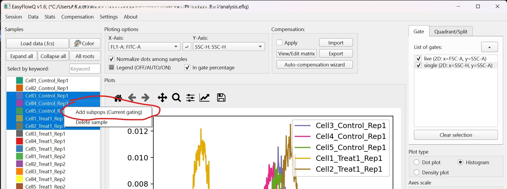

# Sample panel : Subpopulations and Sample selections
This page talks about how the sample panel (the left section of the UI) functions.

## Subpopulation
EasyFlowQ supports subpopulations (or subpops for short). To create subpops, select all the samples that you want to create subpops for, right click and select "Add subpops". You will be asked to provide names for all the subpops. Note "$" in the name will be replaced by their parent names, e.g., "$_GFP+" will become "sample1_GFP+".

The created subpops will consist events that pass all the currently checked gates (**Important note**: This does not necessarily include the "highlighted" gate). Note that all subpops are treated as an individual sample that consist of a subset of their parents' event from now on. This means even you "uncheck" the gates, the subpops will not "gain back" the events that was originally excluded during creation.

You can create subpops based on subpops.

## Sample selection
EasyFlowQ will plot for all the selected (highlighted) samples, including subpops, in the main plotting area (the central part). To facilitate this process, several buttons where located on top of this section:

1. **Load data (.fcs)**: Load fcs files. Same as the option in the drop down "data" menu. (Ctrl+L)
2. **Color**: Change color of all of selected samples.
3. **Expand / Collapse All**: These two buttons are related to subpops. If subpops exist, these two buttons will expand, or collapse all subpops.
4. **All roots**: This button let you select all of the root (level zero) samples.
5. **Select by keyword**: This allows selecting samples by keywords. For example, entering "Treatment1" in the input box and hit ENTER, all the samples whose name contains the keyword of "Treatment1" will be selected for plotting. This is case sensitive.