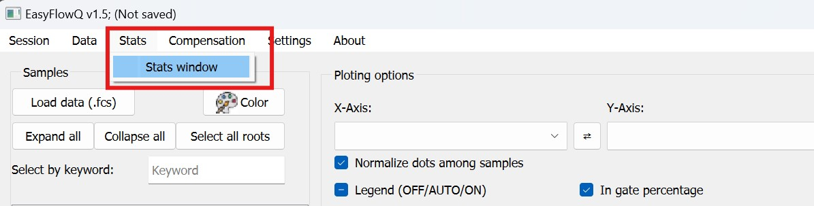
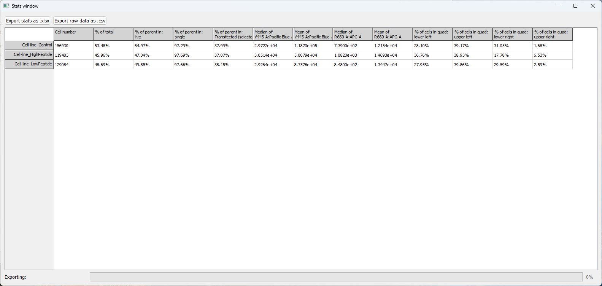

# Viewing the statistics

To view the statistics, select **Stats window** under the **Stats** menu.

{: style="width:600px"}

A typical statistic window looks like the following, when the window is fully extended to show all the columns:

The selected samples are listed as rows of relevant statistics. From left to right, the table shows:

1. Total cell number
2. Cell percentage (of total) in currently checked gate
3. Percentage of each gating step, based on current gate order (from top to bottom in the gating panel). This could take more than one column.
4. The selected (not necessarily checked) gate's percentage. If the selected gate is also checked, this column will be 100%.
5. Mean and median of the currently selected channels of the samples in gates.
6. If selected, quadrant or split statistics.

This whole table can be downloaded as an excel file for further analysis by clicking the button **Export stats as .xlsx** (top left conner).

This window, if left open, will be timely updated when the plotting options, as well as sample or gate selections change in the main window. So in case you want to export multiple stat excel files, we recommend leave this open, and change accordingly in the main window, and export all the files you need. *This will slow down performance slightly.*