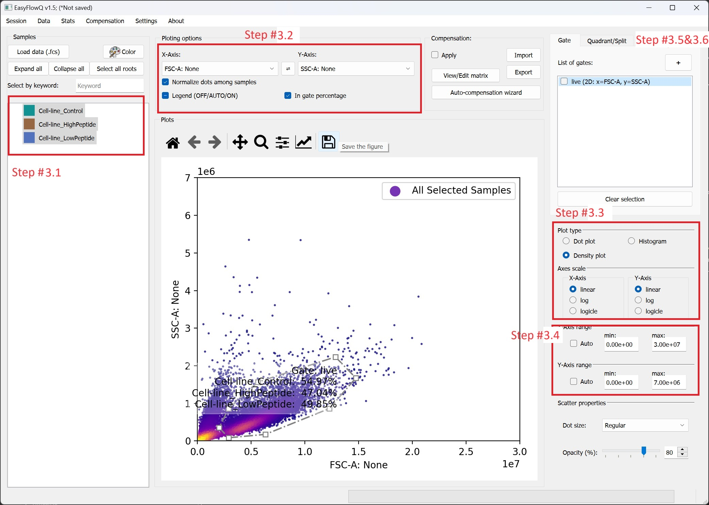
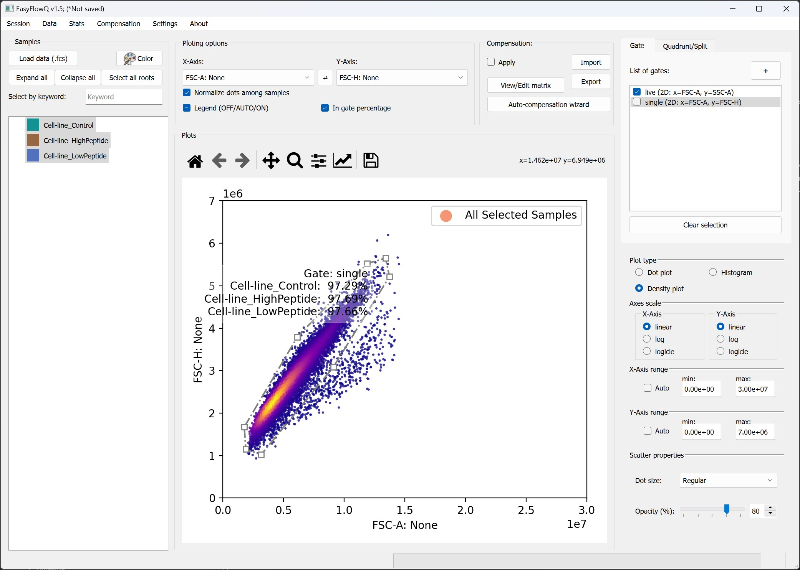
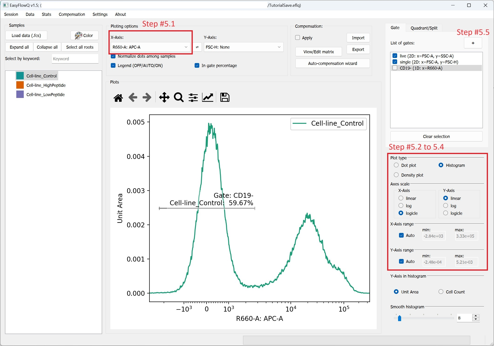
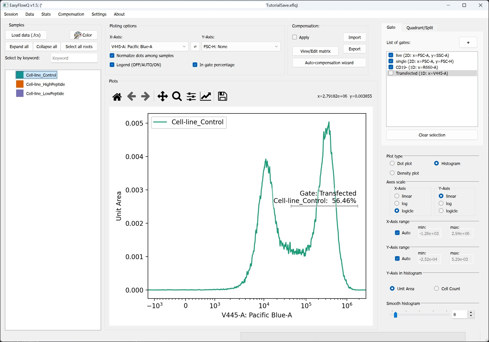
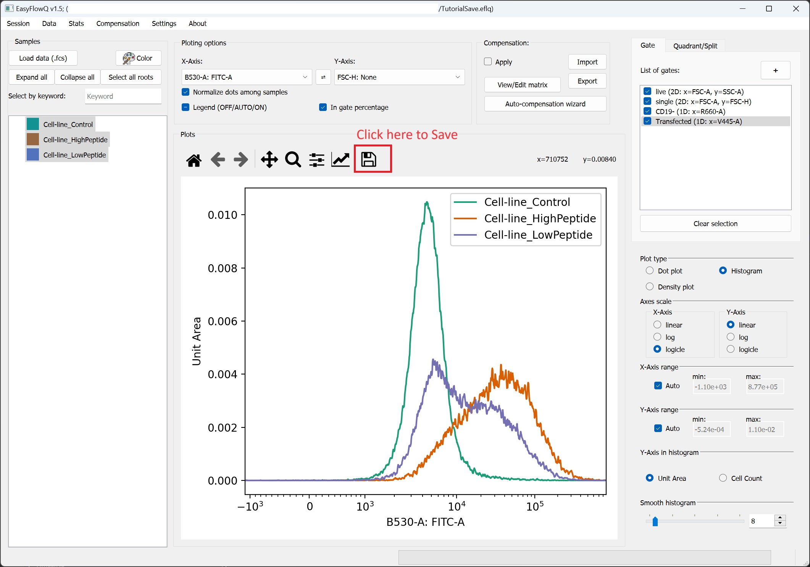

# Step-by-step example

Here we provide a step-by-step example of using EasyFlow to analyze a dataset of T-cell activation in a mix culture of T (Jurkat) and B (T2) cell lines.
The dataset used in this tutorial can be downloaded from: our Github [v1.5 release (manuscript ed.) page](https://github.com/ym3141/EasyFlowQ/releases/tag/v1.5.6). To obtained the data, download the **demo_fcs.zip** file and unzip it into a separate directory. This tutorial is also part of our publication on EasyFlow [EasyFlow: An open-source, user-friendly cytometry analyzer with graphic user interface (GUI)]()

## Step 0: Considerations before start
Before start, we highly recommend your download or move all the data (fcs files) into a local drive on your system, and make sure you have the permission to write to the drive (or folder). Depending on your operation system, it might be helpful to run EasyFlowQ as administrator if possible.

## Step 1: Start EasyFlowQ and load fcs file
Start EasyFlowQ using your [method of choice](README.md#download-install-and-run) (either through a GUI, CLI, or directly from python script). Click the "Load data (.fcs)" button in the interface's upper left corner (Ctrl + L also works). Navigate to the place of your fcs files, and select the following files.

    Cell-line_Control.fcs
    Cell-line_LowPeptide.fcs
    Cell-line_HighPeptide.fcs

Select open, and the fcs files should be loaded.

## Step 2: Save a session file (optional)
We highly recommend to save the session at this point. To do so, simple select "File -> Save" in the menu bar (Ctrl + S also works). We recommend save the session file in the same directory with the fcs file.

## Step 3: Plot FCS-SSC and use polygon gate to select out live cells
1. Plot the data; Select all three sample on the right. Note it is not required to select *all* three samples for this step, as all gate created in this process are "universal".
2. Plot in the FSC-SSC channel: On the panel above the plotting area, select **FSC-A: None** under the "X-Axis" and **SSC-A: None** under Y-Axis.
3. Tweak figure options: On the right panel, select **Density plot** as plot type; Select **linear** under both "Axis scale" for both X and Y axis. 
4. Tweak X and Y range: Uncheck the the **auto** box under both X-Axis and Y-Axis, and change the range to 0 to 3e7 for X, and 0 to 7e6 for Y.
5. Click the **"+"** button next to "List of gate" in the upper right conner. Start drawing out a gate around the "live" cells on the plot using mouse with left clicks. When finish, right click to close the gate. Note, the program will auto-close the gate.
6. A window will pop out, and please enter the desired name of this gate. Here we simply put "live", and click OK.

With the above steps, you should be able to reach a a state similar to the image below:
 

**We can now apply the "live" gate by checking it (click the empty box before the gate name).**

## Step 4: Gate out single cells
Now we switch Y axis to **FSC-H: None** for selecting single cells (top panel). Similar to previous step we now create a gate named "single" around the highly correlated cells. 

 

**We can now apply the "single" gate by checking it, similar to previous step.**

## Step 5: Select out CD19- (APC-) Jurkat cells
To gate out the CD19- (APC-) cells, we need to create a line (1D) gate in the APC channel. To do so, following the steps below:
1. On the top panel, select **R600-A: APC-A** for X-Axis. For simplicity, we also only select the "Control" sample for histogram. 
2. select **Histogram** under the "Plot type". Note, when switch to histogram, the Y-Axis will be ignored.
3. Select **Logicle** for X-Axis' scale, and **Linear** for Y-Axis' scale
4. Check the **Auto** box for both X-Axis' and Y-Axis' range
5. Click the **"+"** button next to "List of gate" in the upper right conner. Start drawing out a "line gate" covering the negative peak of the histogram. When you finish the gate with a 2nd click, a window will pop out, and please enter the desired name of this gate. Here we simply put "CD19-", and click OK.

 

**We can now apply the "CD19-" gate by checking it, similar to previous step.**

## Step 6: Select out transfected cells
Similar to previous step, now switch the X-Axis to **V445-A: Pacific Blue-A** and gate out the positive peak with a gate named "Transfected". *Note for replicating the plot in the paper: you will need to manually adjust the X-Axis to start from 500, and switch the sample to "Cell-line_LowPeptide". We skips these step here for the simplicity.*

 

**We can now apply the "Transfected" gate by checking it, similar to previous step.**

## Step 7: Plot the final figure to compare T cell activation
Now we can finally plot the comparison. Switch to the **B530-A: FITC-A** and select all the samples on the right (or click in the sample box, and press Ctrl-A). To save this figure, click the "save icon" right above the figure, and you can save the figure in multiple formats (png, jpeg, svg, pdf, etc.).

 

## Step 8: Export the statistics
The statistic window is accessible from the menu bar Stats -> Stats window. From there you will get detailed data about cell count and percentage in gate, quardrant or split, as well as median and mean fluorescence data. For more detailed information, pleaes refer to the statistic window page: [Statistics](Statistics.md).

